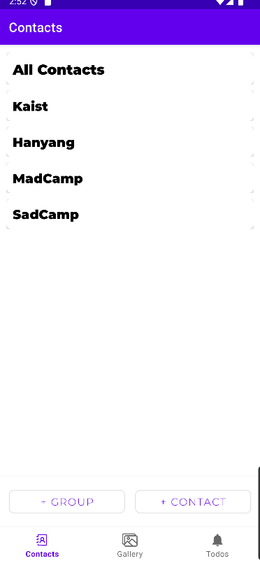
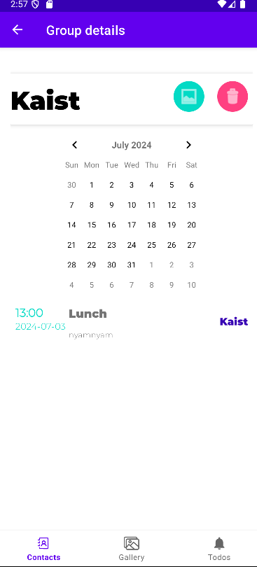
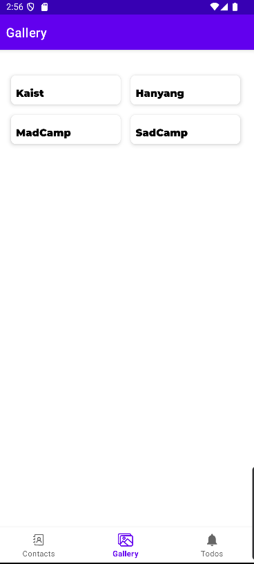
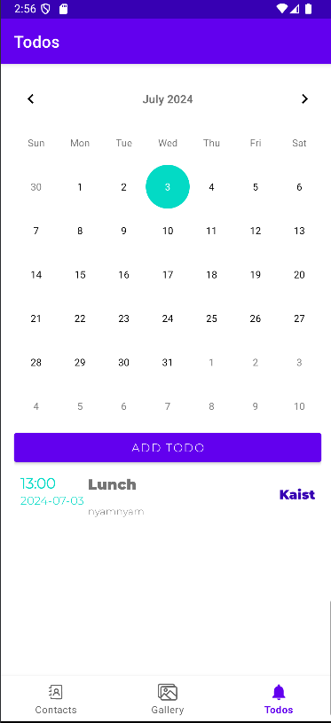

프로젝트 이름 : 

    Gachi

프로젝트 설명 : 

    당신의 협업을 전보다 간편하게,
        
    Gachi는 활동 별로 팀원들의 연락처, 이미지 자료, 그룹 일정을 보다 
    쉽게 정리해주어 사용자가 협업에 몰두할 수 있도록 보조해주는 어플리케이션입니다!

팀원 :
    
    https://github.com/jidnjs
    https://github.com/diesel2580

About :
    
    Contact Tab:

- **모든 연락처** - 추가한 모든 연락처를 확인할 수 있는 그룹입니다.
- **그룹 별 연락처** 디스플레이 - 그룹을 탭하면 해당 그룹에 속한 연락처만 볼 수 있습니다.
- **연락처 정보 수정** - 간단하게 연락처를 탭해서 정보 수정은 물론 이메일, 노트, 그룹에 추가할 수 있습니다.
- **Group tab** - 그룹 클릭시 뜨는 edit버튼을 클릭하면 나오는 탭입니다.
    - **그룹 앨범으로 이동** - 해당 그룹의 앨범으로의 이동은 우측 상단의 버튼을 눌러 한 번에 이동 가능합니다.
    - **그룹 Todo 모아보기** - 해당 그룹 탭의 하단에 캘린더와 그룹에 속한 todo만 디스플레이 됩니다.
    - **그룹 삭제 시 연관 데이터 자동 삭제** - 해당 그룹을 삭제한다면 연관된 모든 Todo, Album이 자동으로 삭제됩니다.
- 이외에도 다른 그룹을 터치하면 열려있던 그룹이 자동으로 닫히거나 이미 속해 있는 그룹은 다시 체크하지 않아도 됩니다!
  
    

    Gallery Tab:

- **Group별 앨범** - 각 그룹의 이름으로 된 앨범이 디스플레이 되어 있어 보다 직관적으로 접근할 수 있습니다.
- **Image의 그룹화** - Group 앨범을 눌러 들어가게 되면 Image를 그룹 별로 모아서 볼 수 있습니다.
- **Group 앨범에 Image추가** - Group 활동을 하다가 필요한 자료는 간단히 버튼을 눌러 갤러리에서 불러올 수 있습니다.
- **Image 상세정보** - 앨범에서 이미지를 클릭하면 이미지가 확대되며 위치, 날짜와 같은 상세정보를 확인할 수 있습니다.
    - **Favorites**를 표시하여 즐겨찾기 기능을 지원합니다.
      

    Todo Tab:

- **캘린더 날짜 선택 시 Add Todo 반영** - 훨씬 빠르고 편리하게 todo를 추가할 수 있습니다.
- **Todo의 그룹화** - 새로운 todo를 만들 때 그룹을 추가하여 어떤 그룹의 활동인지 볼 수 있습니다.
- **슬라이드 시 삭제** - 잘못 추가한 todo는 간단히 슬라이드하여 삭제할 수 있습니다.
  

Beta apk file :
    https://drive.google.com/file/d/1VQluddBxFkkSFkzc6wl1XXZtUNBA70rh/view?usp=sharing
